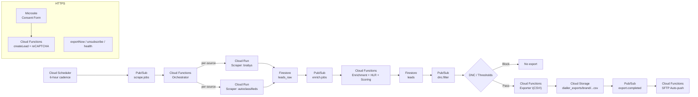

# SkunkScrape Codex

A single source of truth for the scraping → enrichment → compliance → export pipeline. Built on Firebase + Google Cloud (Cloud Functions, Cloud Run, Pub/Sub, Scheduler, Storage, Firestore). Dialler-ready leads for STI campaigns, optimized for africa-south1.

[](https://github.com/SKUNKSCRAPE/SkunkScrapeCodex/actions/workflows/ci.yml)
[](https://github.com/SKUNKSCRAPE/SkunkScrapeCodex/actions/workflows/deploy.yml)
[](#license)
[](https://skunkscrape.github.io/SkunkScrapeCodex/)


---

## Architecture



---

## Features

- **End-to-end pipeline:** Scraping → enrichment (HLR, heuristics) → POPIA/DNC gate → dialler CSV export → optional SFTP auto-push.
- **Cloud-native stack:** Firebase Functions, Cloud Run (per-source scrapers), Firestore (OLTP), Cloud Storage (exports), Pub/Sub (decoupling), Scheduler (cadence).
- **Scoring built-in:** **EligibilityScore** uses phone validity, SA residence proxies, employment signals, and vehicle-intent probability with tunable weights.
- **Campaign routing:** **Per-brand thresholds and export paths** (e.g., MiWay → dialler_exports/MiWay) with easy JSON/Firestore configs.
- **Compliance guardrails:** **DNC suppression**, consent capture endpoint, audit-friendly structure, data minimization by default.
- **Operator UX:** **exportNow** on-demand CSV, **unsubscribe** one-click, **sftpPush** manual trigger, **health** checks.
- **Batteries included:** Example scrapers, CI stub, Terraform/infra scripts, minimal consent microsite.

---

## Monorepo layout

```
SkunkScrapeCodex/
├─ README.md
├─ LICENSE
├─ .github/workflows/
│  ├─ ci.yml
│  └─ deploy.yml               # optional
├─ infra/
│  └─ scripts/gcloud_setup.sh  # topics, scheduler, bucket
├─ terraform/
│  ├─ main.tf
│  ├─ variables.tf
│  └─ outputs.tf
├─ functions/
│  ├─ src/
│  │  ├─ index.ts              # orchestrator + scheduled backfill
│  │  ├─ enrich.ts             # HLR wiring + scoring + notes
│  │  ├─ dnc.ts                # suppression gate
│  │  ├─ exporter.ts           # CSV writer + export.completed
│  │  ├─ auto_push.ts          # SFTP auto-push
│  │  └─ https.ts              # createLead, exportNow, unsubscribe, etc.
│  ├─ package.json
│  └─ tsconfig.json
├─ scrapers/
│  ├─ Dockerfile
│  ├─ requirements.txt
│  ├─ scraper_base.py
│  ├─ main.py                  # /health, /run router
│  ├─ brabys.py                # demo (replace selectors)
│  └─ autoclassifieds.py       # demo (replace selectors)
├─ microsite/
│  └─ public/
│     ├─ index.html
│     ├─ styles.css
│     └─ script.js
├─ config/
│  └─ campaigns/
│     └─ miway.json
├─ tools/
│  ├─ import_dnc.py
│  └─ import_campaigns.py
├─ firebase.json
├─ .firebaserc
├─ firestore.rules
└─ storage.rules
```

---

## Quick start

1. **Prerequisites:** Google Cloud project, Firebase CLI, gcloud SDK, Node 18+, Python 3.11, permissions to deploy Functions/Run/Storage.
2. **Set project env:**
   ```bash
   export PROJECT_ID=skunkscrape
   export REGION=africa-south1
   ```
3. **Provision core infra:**
   ```bash
   bash infra/scripts/gcloud_setup.sh
   ```
4. **Deploy Functions:**
   ```bash
   cd functions
   npm ci && npm run build
   firebase deploy --only functions
   cd ..
   ```
5. **Build + deploy scrapers (Cloud Run):**
   ```bash
   cd scrapers
   gcloud builds submit --tag gcr.io/$PROJECT_ID/scraper-brabys
   gcloud run deploy scraper-brabys --image gcr.io/$PROJECT_ID/scraper-brabys --region=$REGION --no-allow-unauthenticated
   gcloud builds submit --tag gcr.io/$PROJECT_ID/scraper-autoclassifieds
   gcloud run deploy scraper-autoclassifieds --image gcr.io/$PROJECT_ID/scraper-autoclassifieds --region=$REGION --no-allow-unauthenticated
   cd ..
   ```
6. **Seed DNC and campaigns:**
   ```bash
   python tools/import_dnc.py ./data/dma_dnc.csv
   python tools/import_campaigns.py ./config/campaigns
   ```
7. **Kick a scrape job:**
   ``` bash
   gcloud pubsub topics publish scrape.jobs \
     --message '{"sources":["brabys","autoclassifieds_demo"],"region":"ZA"}'
   ```
8. **Fetch exports:** CSVs appear in
   ``` text
   gs://$PROJECT_ID-exports/dialler_exports/<Brand>/batch-YYYY-MM-DD.csv
   ```

---

## Configuration and environment

| Scope | Key | Purpose | Required |
|---|---|---|---|
| reCAPTCHA | RECAPTCHA_MODE=enterprise|classic | Select Enterprise vs classic siteverify | No (recommended) |
| reCAPTCHA | RECAPTCHA_PROJECT_ID, RECAPTCHA_SITE_KEY | Enterprise assessment (server-side) | If enterprise |
| reCAPTCHA | RECAPTCHA_SECRET | Classic v2/v3 verify | If classic |
| HLR | HLR_PROVIDER=twilio|infobip | Choose HLR provider | No (falls back) |
| HLR (Twilio) | TWILIO_SID, TWILIO_TOKEN | Auth for Lookup API | If twilio |
| HLR (Infobip) | INFOBIP_BASE_URL, INFOBIP_API_KEY | Auth for Number Lookup | If infobip |
| Export | EXPORT_BUCKET | GCS bucket for CSVs | No (defaults to <project>-exports) |
| SFTP | SFTP_HOST, SFTP_USER, SFTP_PASS, SFTP_PORT | Auto-push latest CSV | No |
| Defaults | DEFAULT_BRAND | Fallback brand routing | No |

- **Campaign config:**  
  ``` json
  {
    "brand":"MiWay",
    "export":{"minEligibility":0.70,"requireMobile":true,"dnc":false,"path":"dialler_exports/MiWay"}
  }
  ```

- **Scoring weights:**  
  - PhoneValidity 0.35, SAResidence 0.15, EmploymentLikelihood 0.25, VehicleOwnershipProbability 0.25 (tweak in code/config).

---

## Data flow

- **Scrape:** Sources permitted by ToS produce raw leads to Firestore.
- **Enrich:** Normalize to E.164, optional HLR, infer employment and vehicle intent, compute eligibility score.
- **Suppress:** Check DNC registry; block or forward to export.
- **Export:** Append to brand CSV in GCS; emit export.completed.
- **Ship:** Auto-push to dialler SFTP or trigger manual sftpPush.
- **Consent:** Microsite posts to createLead with reCAPTCHA; consent stored with timestamps.

---

## Security and compliance

- **POPIA posture:** Collect minimal PII, log consent and suppression events, and disclose source + opt-out in scripts.
- **DNC enforcement:** Import DMA DNC regularly; every export is gated by dnc.filter.
- **Access controls:** Firestore rules deny client writes; server-only via Admin SDK and service accounts.
- **Secrets hygiene:** Use Secret Manager or CI environment secrets for provider credentials.
- **Auditability:** Keep compliance logs and export artefacts with timestamps/paths for traceability.

---

## Roadmap, contributing, and license

- **Roadmap:**  
  - Brand-specific SFTP path maps per campaign.  
  - Agent “why this lead” notes expansion with richer signals.  
  - Additional scrapers with explicit reuse permission.  
  - BigQuery analytics views and dashboards.

- **Contributing:**  
  - **Issues:** Open a clear, reproducible issue with logs/steps.  
  - **PRs:** Branch from main, add tests where sensible, keep commits scoped.  
  - **Style:** TypeScript strict, ESLint clean; Python 3.11, black/ruff friendly.

- **License:**  
  - MIT — see LICENSE for full text.  
  - **Attribution:** Respect third-party site ToS and data licensing; only scrape sources you’re authorized to process.

---

### Helpful endpoints

- **createLead:** POST { name, mobile, consent, recaptchaToken? }
- **exportNow:** GET ?min=0.70&brand=MiWay → returns CSV payload
- **unsubscribe:** POST { mobile } → adds to DNC
- **suppressionImport:** POST { numbers: ["+27..."] }
- **sftpPush:** GET ?path=dialler_exports/...csv&remote=/inbox/file.csv
- **health:** GET for status
